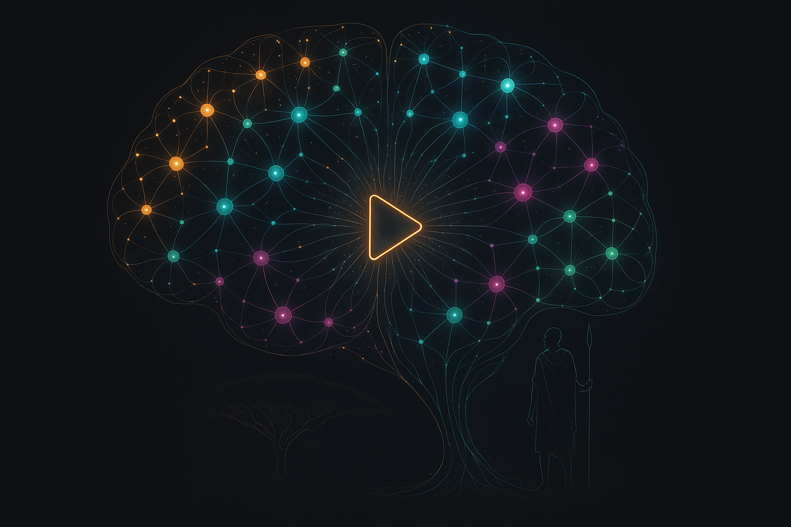

# Maasai Moran → an autonomous AI film **studio**

> A system that **researches what goes viral, writes original films, shoots them with AI cameras that cannot exist, narrates them with one voice, proofreads its own frames, scores their tension, and learns from every view.** It began as one channel's pipeline. It is now a multi-channel studio — and the operator's job is taste.

🌐 **Channels:** [Maasai Explained](https://www.youtube.com/@MaasaiMoran-KK) (searchable East-Africa docu-explainers) · **The Collapse Files** (paper-craft corporate-collapse documentaries) · 🏗️ **Stack:** Node.js, PM2, Gemini Omni Flash, Veo 3, nano-banana-2, Claude, ElevenLabs, gpt-image-1, ffmpeg, YouTube Data API v3 · 🔒 **Source:** private — this is the public write-up

---

## 🧠 The YouTube Brain

<p align="center">
  
</p>

Before a single frame renders, **The Brain** decides what deserves to exist. It is a standalone research engine that:

- **Harvests viral outliers** across the niche (keyless — search, velocity, transcripts of the hooks that worked)
- **Extracts patterns with evidence** — every pattern cites the videos that prove it; no vibes-based strategy
- **Generates channel identities in three bands** (close to the niche / adjacent / same frameworks, different world), scores them on viral ceiling × fit × speed-to-monetize, and locks the winner as a **fingerprint**
- **Sits as a permanent scoring board**: every new episode concept — and every pivot temptation — is scored on the same weighted board (40% ceiling · 35% fit · 25% monetize) against the saved evidence base before a dollar of render spend moves. Concepts that flatter the ego but sever the niche die here, with their kill-risks in writing.
- **Learns from reality**: an analytics loop matches published videos back to the patterns that spawned them — winners strengthen their patterns, flops decay them, and the next research cycle thinks with the new weights.

The Brain's provenance graph (viral sources → patterns → identities → fingerprint → ideas → published videos) renders as a live force-directed **Brain Map** — glowing, type-colored, with flow particles feeding the video-creation hub. The image above is its likeness.

🧠 **[Explore the live Brain Map →](https://kenmwara.github.io/maasai-moran-pipeline/brain-map/)** — drag the neurons, pan, zoom; every node is real data from the active fingerprint's research run.

## 🎬 The production engine (v4 — audio-first)

Every video is manufactured, not generated — and since v4 the **narration is the spine**: the entire voice track is synthesized first as one continuous performance, and every visual is cut to fit its line. Muted gaps and drifting sync are structurally impossible, not hopefully absent.

```
The Brain (scoring board: concept vs evidence base, device vs posted history)
        │
        ▼
Claude screenwriter ── facts from the court/public record only · nested-loop retention
        │              grammar · one verbatim narration line per unit
        ▼
Keyframe forge ── nano-banana-2 / gpt-image-1 renders each unit's hero tableau…
        │         …then a vision model PROOFREADS IT LETTER BY LETTER against the
        │         art direction. Typos, gibberish, invented dates → evict + re-roll,
        │         escalating to fewer text elements. No unproofed frame is animated.
        ▼
Motion pass ── Gemini Omni Flash (direct API) / Veo 3 animates each proofed keyframe;
        │      the finished clip is text-checked at TWO timestamps (animation can
        │      degrade typography mid-clip) — one re-roll, then flagged loudly
        ▼
Audio-first assembly ── one continuous TTS narration track · per-unit segments padded
        │               to measured visual durations · single mix, ducked ambience ·
        │               48kHz stream parity ENFORCED on every render path
        ▼
QA gates that refuse ── per-clip A/V parity (±120ms) · assembly refuses to mix on
        │               >250ms drift · full-film transcript diffed word-by-word
        │               against the screenplay · standalone --qa mode for any artifact
        ▼
Operator review ── the machine manufactures; a human green-lights every release
                   (AI-content disclosure on, always)
```

**Formats:** ~12-minute 16:9 documentary explainers (40+ units, stills + motion interleaved by a pacing plan) and ~3-minute paper-craft collapse files (24 chained scenes) — every film a **new narrative device the channel has never used**.

## 🔬 Model choices are measured, not vibes

The studio A/B-tests its own supply chain with the same discipline as a trading system: same seeds, same briefs, judged by the same letter-by-letter proofreader, costs read off real billing.

| Stage | Incumbent | Challenger | Verdict |
|---|---|---|---|
| Keyframes | gpt-image-1 (~$0.17) | **nano-banana-2 (~$0.04)** | Challenger: zero proven typos on the five worst text-wall briefs; incumbent failed 3/5 |
| Motion | Veo 3 Fast (~$0.40/8s) | **Gemini Omni Flash (~$0.10/s)** | Challenger holds typography through animation better; neither is immune — the two-frame gate stays |
| Fixing a bad clip | full re-roll | conversational video edit | **Re-roll wins** — measured edits cost more than fresh clips and didn't fix the text |

## 🛡️ Built to run unattended

- **Credit + key preflight** before every film — a run that can't finish never starts
- **Per-unit resilience** — safety-filter false positives get a sanitized rewrite, then a skip; a 43-unit film beats an aborted one
- **Screenplay persistence + resume** — an interrupted film re-renders only its missing units; already-paid API outputs are cached and reused across relaunches
- **Cached ≠ trusted** — cached keyframes and clips re-run the QA gates on every build; a cached typo is still a typo
- **Fail-soft everything** — a flaky image host, or a blocked scene never kills a cycle; failures ping the operator and the run proceeds
- Runs on a shared trading droplet under PM2 at `nice -15`/idle-IO with a hard memory cap — the studio can never starve the systems that pay for it

## 💸 Unit economics

| Asset | Cost | Notes |
|---|---|---|
| Proofread keyframe | ~$0.04 | nano-banana-2, vision-QA'd, re-rolls included in the ~10% overhead |
| 8s motion clip | ~$0.53–0.81 | Omni Flash (aggregator vs direct), text-checked twice |
| ~12-min documentary (44 units) | **~$15–25 all-in** | screenplay, voice, frames, motion, QA, thumbnail |
| ~3-min collapse file (24 scenes) | ~$12–20 | all-motion paper-craft |

A one-person film studio's output for the price of a dinner — with a QA department made of code.

---

*The machine researches, writes, shoots, proofreads, and assembles. The operator's job is taste: watch, judge, green-light — and tune the mandates.*
